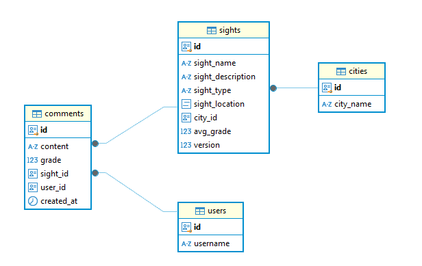

# SIMPLE TRAVEL GUIDE

## Использованные технологии

* [Spring Boot](https://spring.io/projects/spring-boot) – как основной фрэймворк
* [PostgreSQL](https://www.postgresql.org/) – как основная реляционная база данных
* [PostGis](https://postgis.net/) - как плагин PostgreSQL который добавляет поддержку хранения, индексации и запроса геопространственных данных.
* [Liquibase](https://www.liquibase.org/) – для ведения миграций схемы БД
* [Gradle](https://gradle.org/) – как система сборки приложения
* [Docker](https://www.docker.com/) - развертывание среды разработки
* [GitHub Actions](https://docs.github.com/ru/actions) - настройка CI для сборки и тестирования

## Локальный запуск

**1. Убедитесь, что у вас установлен Docker и Docker Compose**

Для проверки введите в терминале:
```shell
docker --version
docker-compose --version
```

**2. Запуск приложения:**
```shell
docker-composer up
```

**3. Остановка приложения**
```shell
docker-compose down
```

## Описание

В данном приложении реализован REST API путеводителя по городам.
В БД сервиса хранятся достопримечательности городов с указанными названием, категорией и географическими координатами. 
Также для каждой достопримечательности пользователи могут написать свой отзыв, а также выставить свою оценку от 1 до 5.

Entity Relationship представлена на рисунке ниже:



